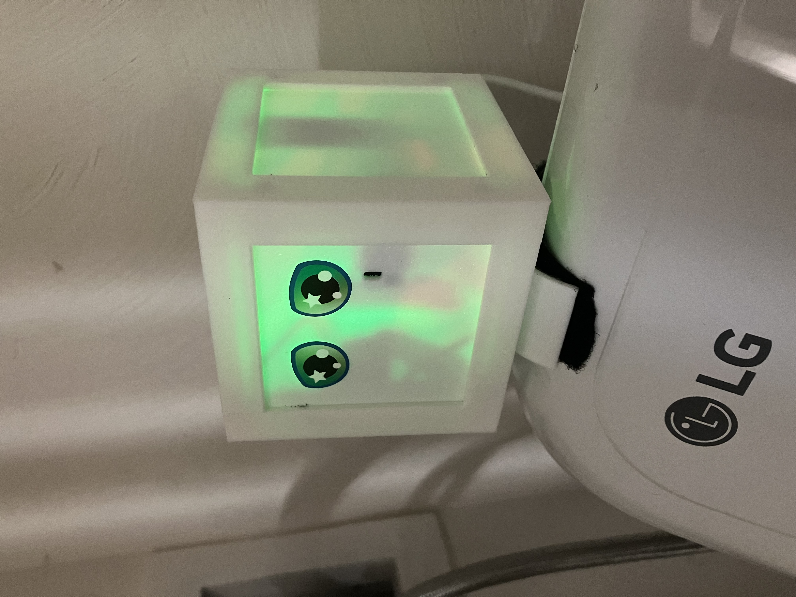
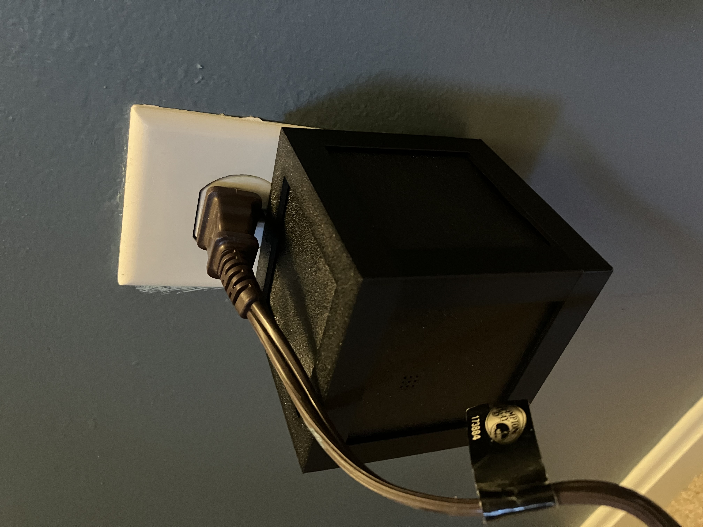
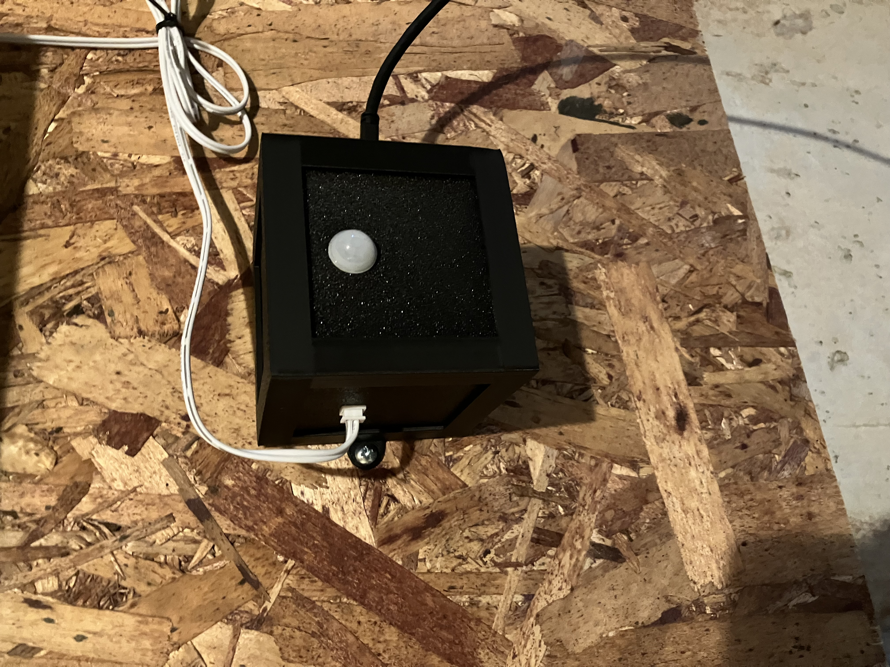
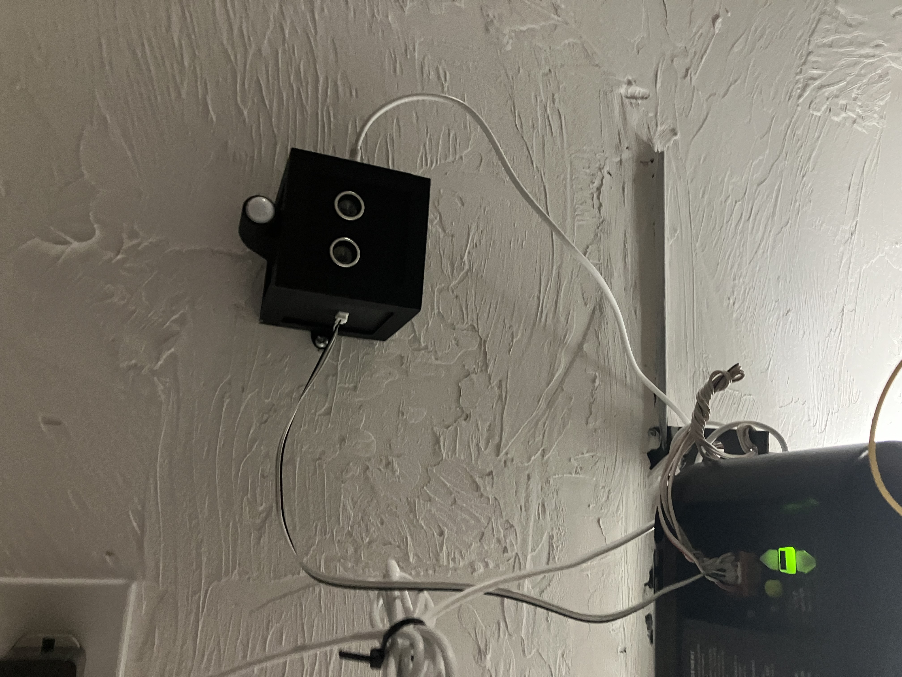

# QB1

QB1 is a rapid prototyping system for ESP32 devices. The system was designed for ESPHome sensors, but it could potentially be used for other applications.

## Features

* Rapid prototyping for testing sensors and automation in the intended environment.
* Modular design allows each device to be built with the appropriate sensors, power interface, and mounting solutions. The five cube faces can each be used for a different purpose. 
* The QB1 specification allows multiple sensors to exist on the same device without conflict.
* Easy to make. 
  * The enclosure can be produced using a low cost 3D printer. 
  * The main board can be assembled quickly with basic soldering skills.
  * Many common sensor can be integrated by printing a custom face plate and connecting the sensor to the main board with Dupont wire. 
* Once constructed, the device can be modified without soldering, enabling rapid modification of devices. 

## Example Projects

<table>
  <tr>
    <td>
       
      Washing machine monitor using SW-420 vibration sensor to detect when the machine is running and V53L0X distance sensor to tell when lid has been opened. The device is mounted to the washing machine using a custom mounting plate and velcro tape, and it is used to send a notification when wet clothes have been left in the wachine machine. 
    </td>
    <td>
       
      Plug-in temperature and humidity monitor using SHT40. The device plugs in to the wall using an off-the-shelf USB wall plug that is inside the QB1 enclosure and held in place using a custom face plate. 
    </td>
  </tr>

  <tr>
    <td>
       
      A wall-mounted human presence sensor that combines an AM312 PIR motion sensor and a wired magnetic reed door sensor. The device is used turn on/off lights in the area based on human presence. 
    </td>
    <td>
       
      A ceiling-mounted device that combines human presence detection using an AM312 PIR motion sensor, car presence detection using an HC-SR04 distance sensor, and garage door control/status using a <a href="https://github.com/PaulWieland/ratgdo">ratgdo-compatible</a> peripheral board. 
    </td>
  </tr>
</table>

## Building

The core QB1 components can be built with basic tools and skills. 

### Tools Required

* A [soldering iron](https://amzn.to/4105tMp) and related supplies. The QB1 main board contains only through hole components, so only basic soldering skills are required. Some peripheral boards require surface mount components and more advanced soldering skills. 
* A basic 3D printer to print the QB1 enclosure and face plates. Using a print-on-demand service (or a friend with a printer) can help get you started, but having your own printer makes it much easier to print new faceplates to modify the device in the future. The [Bambu Lab A1 Mini](https://bambulab.com/en/a1-mini) (without AMS) is inexpensive and well-suited to printing smaller items like the QB1 enclosure. 
* A small Phillips screwdriver (or driver matching the head of the screws, if not Phillips). The shaft must be smaller than 5.5 mm in diameter in order to fit in the holes in the bottom of the enclosure. 
* A small tube of super glue to build some of the enclosure parts. 
* (Optional) A [hot glue gun](https://amzn.to/40Knkqm). Many sensors that operate at 3.3v can be connected directly to the main board using Dupont wire. It's best to glue these connectors in place so they don't fall off in operation. The hot glue can easily be removed later. 

### Components Required

All components other than custom circuit boards and 3D-printed enclosure parts can be purchased in small quantities from Amazon or AliExpress.

* A QB1 main board. You can order a small batch of 5 main boards using this [PCBWay project](https://www.pcbway.com/project/shareproject/QB1_Main_Board_for_ESP32_Development_Kit_a3892956.html). You can also use the zipped Gerber files provided in a QB1 release to order the board from another supplier. 
* A [30-pin ESP32 development board](https://amzn.to/4lGmVin) with USB-C connector. You can choose a device with the right storage and other features for your application.
* (7) [Female 15-pin, single row board header with 2.54 mm pin spacing](https://amzn.to/4suHbWA). You will need two for the ESP32 dev kit socket and up to 5 for the remaining QB4 faces.
* [Screws](https://amzn.to/47RIYwE): M3, self-tapping, coarse threaded with pan/button head. The head must be between 3.5mm and 5.5mm in diameter.
  * (8) To secure the main board and close the case, use screws that are 8mm long (not counting the head), but screws up to 16 mm in length will also work.
  * (4, Optional) To make the top plate removable and functional, use screws that are exactly 8mm long (not counting the head). In most cases, the top plate is not used for sensors or other peripherals, because the four side plates are sufficient. In this case, it can be glued in place, and these screws are unnecessary.
* [Printed enclosure parts](https://makerworld.com/en/collections/23142249-qb1): A top, a bottom, face plates for mounting and peripherals, and blank plates to cover any remaining faces. 
* (Optional) Any additional components required for peripherals. See peripheral doc for mor information. Some generally useful items to have on hand are:
  * [Dupont wire](https://amzn.to/4slY8CT) with male connector on one end and female connector on the other. The wire should be between 10 and 20cm in length. This wire is useful for hooking up small sensors that do not require a QB1 peripheral board. 
  * [Small prototyping boards](https://amzn.to/4sSRvYk) (e.g 40 mm by 60 mm) can be used to develop peripheral boards.  

### Assembling the Boards

Follow the instructions provided to assemble the QB1 [main board](/mainboards/ESP32DK) and any peripheral boards.

### Assembling the QB1

* Insert the ESP32 development board into the pair of 15-pin sockets on the bottom of the QB1 main board. Use the labels on the PCB silk screen to orient the ESP32 board correctly.  
* Place the main board on the tall screw hole supports inside the enclosure bottom. Ensure that the board is oriented correctly so that the ESP32 dev board screw holes rest on the lower supports and the USB-C connector faces the opening on the bottom plate. Screw the main board in place with 4 M3 screws.
* Place the USB-C port cover in the enclosure bottom and glue it in place with super glue. 
* Attach peripherals
  * For peripherals that are attached by wires, plug the connector into the appropriate place in the main board. Secure the connectors in place using hot glue, and attach the peripheral to its custom face plate.  
  * Attach peripheral boards to their custom plates. These boards typically have male header that connects to the main board and is held in place by the enclosure. This connection will be made when the face plates are inserted in a later step.
* Place the QB1 enclosure top upside down on a flat surface.
* Insert a face plate into the QB1 top face. The plate will be held lightly in place by friction against the screw supports. To hold this plate more firmly, place two top plate holders over the plate and screw them in place. 
* Place face plates into the four slots at the top of the enclosure. 
* Place the QB1 enclosure bottom upside down onto the top. To ensure that the peripheral boards are attached correctly to the main board connector: lift each perhipheral board slightly to make the connection, then lower the enclosure bottom after all connections are made. It may be necessary to wiggle the legs of the enclosure top to ensure that they are seated correctly. 
* Screw the bottom to the top using 4 M3 screws. 

## FAQ

* **When would I use this?** QB1 is useful in a few circumstances: 
  * When you want to quickly prototype a device to test its behavior in the intended environment. 
  * When you need multiple sensors in a single device.
  * When you need to deploy sensors in a basement/garage or other utility area where appearance/size is less important.
* **When wouldn't I use this?** There are some limitations:
  * QB1 is nearly 80 mm long on each side. For many applications, a custom board and enclosure would be smaller. 
* **How do I use this for home sensing and automation?** See the [ESPHome site](https://esphome.io) for more information. A typical solution is to set up a [Home Assistant](https://www.home-assistant.io) hub that takes information from QB1 devices (and other sensors). 
* **Does the QB1 look good?** Looks are subjective, but yes. 
* **What sensors are supported?** Any sensor that operates at 3.3v and has a fairly simple interface (a few IO pins, I2C, SPI, etc.) can be wired directly to the appropriate pins on the QB1 main board. Then all that is needed is a face plate that holds the sensor in place. Sensors/components with more complicated interfaces can be integrated by developing a peripheral board with additional interface components. 
* **How do I add an external connector?** The best ways to achieve this are:
  * Locate a panel-mount connector and attach it to the main board using wires.
  * Make a simple peripheral board with connectors soldered to it. A male JST-XH connector soldered to a peripheral board will sit approximately flush with the face plate. 
* **How do I configure ESPHome?** Locate ESPHome documentation for the sensor you would like to configure. Look at the main board documentation or silk screen markings on the main board to determine which pins are attached to each connector position. 
* **What happens if I plug in multiple peripherals? How do I keep them from conflicting?** The QB1 spec assigns pins to each peripheral position. Some pins are shared, such as pins intended for the I2C and SPI buses. Each peripheral position also has four pins that are dedicated to that position (with the exception of EB2 and EB5, that have the same set of "dedicated" pins). Where possible, a peripheral should use dedicated pins or buses in order to avoid conflict.
* **The screws are too tight/loose. What is wrong?** To keep the part count low, the design does not use screw inserts, and instead uses self-tapping screws that screw into 3D-printed holes. Due to variation in printers and settings, these holes may be slightly too large/small. To fix it:
  * If the hole is too tight, carefully drill it out. Forcing the screw in without drilling may cause the plastic to crack.
  * If the hole is too loose, add a small amount of hot glue, allow the glue to cool, then screw in the screw. Hot glue can also be used to repair screw holes that are cracked or worn out. 
* **What options should I select when ordering boards from PCBWay?** Unless you have a compelling reason to change the options, you can use the default settings when ordering boards. 
* **How can I get a QB4 if I don't have a 3D printer or soldering iron?** There are a few options:
  * Order assembled boards and printed enclosure parts from an electronics fab and print-on-demand service, respectively.
  * Join a local maker space that has 3D printers and electronics assembly tools. 
  * Find someone near you with a 3D printer and buy enclosure parts from them. Many people who own a 3D printer would be thrilled to print something for you in exchange for a small amount of money to pay for their filament habit. 
  * Use this project as an excuse to buy what you need. Soldering supplies are inexpensive. Small/basic 3D printers are now cheap and reliable enough that they should be considered essential tools for any homeowner. 

## Support and Transparency

If you are fortunate enough to have a store near you that sells basic electronics components, please consider buying components from them instead of using the links on this site or ordering from internet retailers.

I (the developer of QB1) earn a commission from tools and components purchased though links on this site. As an Amazon Associate, I earn from qualifying purchases. I also earn a commission from circuit boards ordered from PCBWay. I chose the recommended tools/components by searching for products with the correct specs and features, but I haven't tried them all. Please review the product description, specs, reviews, etc. before ordering.

If you would like to directly support the development of QB1, you can donate using [Buy me a coffee](https://buymeacoffee.com/fusedbydesign). 
 